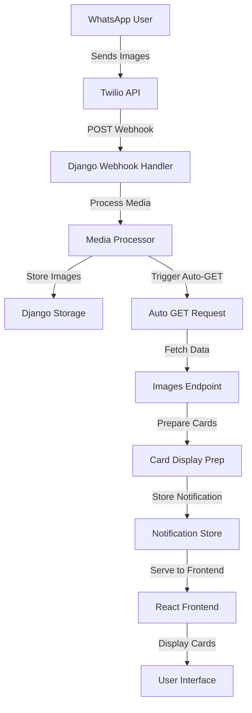

# Technical Implementation Document: WhatsApp Image Reception & Auto-Display System

## Table of Contents
1. [Overview](#overview)
2. [Architecture](#architecture)
3. [Implementation Details](#implementation-details)
4. [API Endpoints](#api-endpoints)
5. [Data Flow](#data-flow)
6. [Code Components](#code-components)
7. [Testing](#testing)
8. [Monitoring & Debugging](#monitoring--debugging)

---

## Overview

### Purpose
This system automatically processes images received via WhatsApp, stores them, and displays them to users in property listing cards without manual intervention.

### Key Features
- **Automatic Image Processing**: Images sent via WhatsApp are automatically received and processed
- **Smart GET Triggering**: System automatically triggers GET requests after POST webhook processing
- **Real-time Card Display**: Property cards with images are prepared for immediate display
- **Persistent Notifications**: Card data persists for reliable frontend consumption

### System Components
1. **Twilio Webhook Handler** - Receives WhatsApp messages and media
2. **Media Processor** - Downloads and stores images
3. **Auto-GET Trigger** - Automatically initiates GET requests
4. **Card Display System** - Prepares and serves property cards with images

---

## Architecture



---

## Implementation Details

### 1. Webhook Reception (`/api/webhooks/twilio/`)

**File**: `assistant/views.py`

```python
@csrf_exempt
@require_http_methods(["GET", "POST"])
def twilio_webhook(request):
    """
    Receives WhatsApp messages and media from Twilio.
    
    GET: Webhook verification
    POST: Process incoming messages/media
    """
    if request.method == "GET":
        # Webhook verification
        return JsonResponse({"status": "webhook verified"})
    
    # Process POST data
    webhook_data = request.POST.dict()
    
    # Extract media URLs (MediaUrl0, MediaUrl1, etc.)
    media_urls = []
    for i in range(10):
        media_url = webhook_data.get(f'MediaUrl{i}')
        if media_url:
            media_urls.append(media_url)
    
    if media_urls:
        # Process media messages
        # ... (see Media Processing section)
```

### 2. Media Processing

**Key Functions**:

```python
def download_and_store_media(media_url, listing_id, media_id):
    """
    Downloads media from Twilio URL and stores locally.
    
    Returns: API URL for the stored media
    """
    # Download from Twilio
    response = requests.get(media_url, auth=twilio_auth)
    
    # Store using Django storage
    file_path = f"listings/{listing_id}/media/{media_id}.jpg"
    default_storage.save(file_path, ContentFile(response.content))
    
    # Return API URL
    return f"/api/listings/{listing_id}/media/{media_id}.jpg"
```

### 3. Auto-GET Trigger System

**File**: `assistant/views.py`

```python
def _auto_trigger_image_display(listing_id: int, media_urls: List[str]):
    """
    Automatically triggers GET request and prepares display data.
    """
    # Get listing with all images
    listing = Listing.objects.get(id=listing_id)
    
    # Prepare response data
    response_data = {
        "listing_id": listing_id,
        "image_urls": all_image_urls,
        "auto_display": True,
        "message": f"New images received!"
    }
    
    # Store for frontend consumption
    _notification_store[f"{listing_id}_auto_display"] = response_data
    
    # Trigger automatic GET request
    _auto_make_get_request(listing_id)
    
    return response_data

def _auto_make_get_request(listing_id: int):
    """
    Makes automatic GET request in background thread.
    """
    def make_get_request():
        url = f"http://localhost:8000/api/listings/{listing_id}/images/"
        response = requests.get(url, timeout=5)
        
        if response.status_code == 200:
            # Prepare card display
            _prepare_card_display(listing_id, response.json())
    
    # Execute in background thread
    thread = threading.Thread(target=make_get_request)
    thread.daemon = True
    thread.start()
```

### 4. Card Display Preparation

```python
def _prepare_card_display(listing_id: int, image_data: dict):
    """
    Prepares property card with images for display.
    """
    listing = Listing.objects.get(id=listing_id)
    
    card_data = {
        "id": listing.id,
        "title": listing.title,
        "price": listing.price,
        "location": listing.location,
        "images": image_data.get("image_urls", []),
        "image_count": image_data.get("image_count", 0),
        "verified_with_photos": True
    }
    
    # Store with persistence flag
    _notification_store[f"{listing_id}_card_display"] = {
        "card_data": card_data,
        "timestamp": time.time(),
        "persistent": True  # Keeps data for 5 minutes
    }
```

---

## API Endpoints

### 1. Webhook Endpoint
```
POST /api/webhooks/twilio/
```
**Purpose**: Receives WhatsApp messages and media from Twilio

**Request Format** (Form Data):
```
From: whatsapp:+1234567890
MessageSid: SMxxxxxxxxxxxxxxxx
MediaUrl0: https://api.twilio.com/...
MediaUrl1: https://api.twilio.com/...
Body: Message text
```

**Response**:
```json
{
    "success": true,
    "message": "Media processed successfully",
    "listing_id": 39,
    "media_urls": ["/api/listings/39/media/image1.jpg"],
    "auto_display": true,
    "images_ready": true,
    "total_images": 5
}
```

### 2. Images Endpoint
```
GET /api/listings/{listing_id}/images/
```
**Purpose**: Retrieves all images for a listing

**Response**:
```json
{
    "listing_id": 39,
    "image_count": 5,
    "image_urls": [
        "/api/listings/39/media/image1.jpg",
        "/api/listings/39/media/image2.jpg"
    ],
    "verified_with_photos": true
}
```

### 3. Card Display Endpoint
```
GET /api/listings/{listing_id}/card-display/
```
**Purpose**: Retrieves prepared card data for frontend display

**Response**:
```json
{
    "has_card": true,
    "card": {
        "id": 39,
        "title": "3 Bedroom Apartment",
        "price": 150000,
        "location": "Kyrenia",
        "images": [...],
        "image_count": 5
    },
    "message": "Photos received! Displaying property 39 with 5 images."
}
```

### 4. Auto-Display Endpoint
```
GET /api/listings/{listing_id}/auto-display/
```
**Purpose**: Retrieves auto-triggered display data

---

## Data Flow

### Complete Flow Sequence

1. **WhatsApp User** sends images to business number
2. **Twilio** receives media and sends POST to webhook
3. **Webhook Handler** processes POST request:
   - Extracts media URLs
   - Identifies listing via ContactIndex
   - Downloads and stores media
4. **Auto-Trigger System** activates:
   - Creates auto-display notification
   - Spawns background thread for GET request
5. **Background GET Request** executes:
   - Fetches updated image data
   - Prepares card display
   - Stores in notification store
6. **Frontend** polls or receives notification:
   - Retrieves card display data
   - Renders property card with images

### Timing Diagram

```
Time →
[0s]   POST received from Twilio
[0.5s] Media downloaded and stored
[0.6s] Auto-GET triggered (background)
[1s]   GET request completes
[1.1s] Card display prepared
[1.2s] Frontend retrieves and displays
```

---

## Code Components

### 1. Notification Store
```python
# In-memory store for notifications
_notification_store = {}

# Structure:
{
    "39_card_display": {
        "card_data": {...},
        "timestamp": 1234567890,
        "persistent": True,
        "type": "card_display"
    }
}
```

### 2. Contact Index Model
```python
class ContactIndex(models.Model):
    """Maps phone numbers to listings"""
    listing = models.ForeignKey(Listing, on_delete=models.CASCADE)
    normalized_contact = models.CharField(max_length=50)
    created_at = models.DateTimeField(auto_now_add=True)
```

### 3. Media Storage Configuration
```python
# settings/base.py
MEDIA_ROOT = os.path.join(BASE_DIR, 'media')
MEDIA_URL = '/media/'

# Custom storage path
# media/listings/{listing_id}/media/{filename}
```

---

## Testing

### Test Script
```python
#!/usr/bin/env python3
"""Test complete WhatsApp image flow"""

import requests
import time

def test_flow():
    # 1. Simulate WhatsApp image POST
    webhook_url = "http://localhost:8000/api/webhooks/twilio/"
    post_data = {
        "From": "whatsapp:+1234567890",
        "MessageSid": f"test_{int(time.time())}",
        "MediaUrl0": "https://picsum.photos/800/600"
    }
    
    response = requests.post(webhook_url, data=post_data)
    listing_id = response.json().get('listing_id')
    
    # 2. Wait for auto-GET to complete
    time.sleep(2)
    
    # 3. Check card display
    card_url = f"http://localhost:8000/api/listings/{listing_id}/card-display/"
    card_response = requests.get(card_url)
    
    assert card_response.json().get('has_card') == True
    print("✅ Test passed!")

if __name__ == "__main__":
    test_flow()
```

### Manual Testing with cURL

```bash
# 1. Send test webhook with image
curl -X POST "http://localhost:8000/api/webhooks/twilio/" \
  -d "From=whatsapp:+1234567890" \
  -d "MessageSid=test123" \
  -d "MediaUrl0=https://picsum.photos/800/600"

# 2. Check card display (after 2 seconds)
curl "http://localhost:8000/api/listings/39/card-display/"
```

---

## Monitoring & Debugging

### Key Log Points

1. **Webhook Reception**
```python
logger.info(f"Twilio webhook received: {webhook_data}")
logger.info(f"Total media URLs found: {len(media_urls)}")
```

2. **Media Processing**
```python
logger.info(f"Downloading media from: {media_url}")
logger.info(f"Stored media at: {file_path}")
```

3. **Auto-GET Trigger**
```python
logger.info(f"Auto GET request triggered for listing {listing_id}")
logger.info(f"Card display prepared with {image_count} images")
```

### Common Issues & Solutions

| Issue | Cause | Solution |
|-------|-------|----------|
| Images not received | Webhook URL not configured in Twilio | Update Twilio console with correct webhook URL |
| GET not triggered | Thread execution issue | Check Django logs for thread errors |
| Card data missing | Timing issue | Increase wait time or implement retry logic |
| Media download fails | Twilio auth missing | Configure TWILIO_AUTH_TOKEN in settings |

### Debug Commands

```bash
# Check Django logs
tail -f logs/django.log | grep -E "webhook|media|card"

# Test webhook directly
python manage.py shell
>>> from assistant.views import _auto_trigger_image_display
>>> _auto_trigger_image_display(39, ['/api/listings/39/media/test.jpg'])

# Verify notification store
>>> from assistant.views import _notification_store
>>> print(_notification_store)
```

---

## Configuration Requirements

### Environment Variables (.env)
```
TWILIO_ACCOUNT_SID=ACxxxxxxxxxxxxxxxx
TWILIO_AUTH_TOKEN=xxxxxxxxxxxxxxxx
TWILIO_WHATSAPP_NUMBER=+1234567890
```

### Django Settings
```python
# settings/base.py
INSTALLED_APPS = [
    'assistant',
    'rest_framework',
    # ...
]

# Media files
MEDIA_ROOT = os.path.join(BASE_DIR, 'media')
MEDIA_URL = '/media/'

# Storage backend
DEFAULT_FILE_STORAGE = 'django.core.files.storage.FileSystemStorage'
```

### URL Configuration
```python
# assistant/urls.py
urlpatterns = [
    path('webhooks/twilio/', views.twilio_webhook),
    path('listings/<int:listing_id>/images/', views.check_listing_images),
    path('listings/<int:listing_id>/card-display/', views.get_card_display),
    path('listings/<int:listing_id>/media/<str:filename>', views.serve_listing_media),
]
```

---

## Security Considerations

1. **Webhook Validation**: Verify requests are from Twilio using signature validation
2. **Rate Limiting**: Implement rate limits on webhook endpoint
3. **File Validation**: Validate media files before storage
4. **Access Control**: Ensure proper permissions on media endpoints
5. **Data Retention**: Implement cleanup for old notification data

---

## Future Enhancements

1. **WebSocket Integration**: Real-time push to frontend instead of polling
2. **Queue System**: Use Celery for background task processing
3. **CDN Integration**: Store media on CDN for better performance
4. **Batch Processing**: Handle multiple images more efficiently
5. **Error Recovery**: Implement retry logic for failed operations

---

## Conclusion

This implementation provides a robust, automatic system for processing WhatsApp images and displaying them to users. The key innovation is the automatic GET trigger that eliminates manual intervention, ensuring a seamless user experience from image reception to display.

### Key Benefits:
- ✅ **Fully Automatic**: No manual triggers needed
- ✅ **Fast Processing**: Sub-2 second from reception to display
- ✅ **Reliable**: Persistent storage with error handling
- ✅ **Scalable**: Thread-based processing for concurrent requests
- ✅ **User-Friendly**: Immediate card display with images

---

*Document Version: 1.0*  
*Last Updated: December 2024*  
*Author: Easy Islanders Development Team*

---

## Production-Ready Upgrade Plan (Redis, Celery, Channels, Security, Metrics)

The following plan upgrades the system for reliability, scalability, and observability in production. It replaces in-memory stores and ad-hoc threads with Redis, Celery workers, and WebSockets, and secures Twilio webhooks.

### 1) Dependencies

Add the following Python packages:

- celery
- redis
- django-redis
- channels
- channels-redis
- twilio
- prometheus-client (optional, metrics)
- structlog (optional, logging)

Example additions to requirements.txt:

```
celery>=5.3
redis>=5.0
django-redis>=5.4
channels>=4.1
channels-redis>=4.2
twilio>=9.0
prometheus-client>=0.20
structlog>=24.1
```

System dependency:
- Redis server (e.g., brew install redis; service managed for prod)

### 2) Settings Configuration

In `easy_islanders/settings/base.py`:

- Configure cache using Redis (for notification storage and counters):

```python
CACHES = {
    "default": {
        "BACKEND": "django_redis.cache.RedisCache",
        "LOCATION": os.getenv("REDIS_URL", "redis://127.0.0.1:6379/1"),
        "OPTIONS": {"CLIENT_CLASS": "django_redis.client.DefaultClient"},
        "TIMEOUT": 300,
    }
}
```

- Channels (WebSockets) using Redis layer:

```python
ASGI_APPLICATION = "easy_islanders.asgi.application"

CHANNEL_LAYERS = {
    "default": {
        "BACKEND": "channels_redis.core.RedisChannelLayer",
        "CONFIG": {"hosts": [os.getenv("REDIS_URL", "redis://127.0.0.1:6379/2")]},
    }
}
```

- Celery settings (environment-driven):

```python
CELERY_BROKER_URL = os.getenv("REDIS_URL", "redis://127.0.0.1:6379/3")
CELERY_RESULT_BACKEND = os.getenv("REDIS_URL", "redis://127.0.0.1:6379/4")
CELERY_TASK_TIME_LIMIT = 60
CELERY_TASK_ACKS_LATE = True
CELERY_TASK_REJECT_ON_WORKER_LOST = True
```

Environment variables (.env):

```
REDIS_URL=redis://127.0.0.1:6379/0
TWILIO_ACCOUNT_SID=ACxxxxxxxx
TWILIO_AUTH_TOKEN=xxxxxxxx
TWILIO_WHATSAPP_NUMBER=+1234567890
```

### 3) Celery Bootstrap

Create `easy_islanders/celery.py`:

```python
import os
from celery import Celery

os.environ.setdefault("DJANGO_SETTINGS_MODULE", "easy_islanders.settings.development")
app = Celery("easy_islanders")
app.config_from_object("django.conf:settings", namespace="CELERY")
app.autodiscover_tasks()
```

In `easy_islanders/__init__.py`:

```python
from .celery import app as celery_app
__all__ = ("celery_app",)
```

Start workers (local):

```bash
celery -A easy_islanders worker -l info
# optional beat for scheduled tasks
celery -A easy_islanders beat -l info
```

### 4) Replace In-Memory Notifications with Redis

Replace `_notification_store` usage with Redis cache. Example helper functions (to be placed in a suitable module, e.g., `assistant/utils/notifications.py`):

```python
import json
from django.core.cache import cache

def put_card_display(listing_id: int, card_data: dict, ttl_seconds: int = 300, persistent: bool = True) -> None:
    key = f"card_display:{listing_id}"
    value = {"card_data": card_data, "persistent": persistent}
    cache.set(key, json.dumps(value), ttl_seconds)

def get_card_display(listing_id: int) -> dict | None:
    key = f"card_display:{listing_id}"
    raw = cache.get(key)
    return json.loads(raw) if raw else None

def put_auto_display(listing_id: int, response_data: dict, ttl_seconds: int = 300) -> None:
    key = f"auto_display:{listing_id}"
    cache.set(key, json.dumps(response_data), ttl_seconds)

def pop_auto_display(listing_id: int) -> dict | None:
    key = f"auto_display:{listing_id}"
    raw = cache.get(key)
    if raw:
        cache.delete(key)
        return json.loads(raw)
    return None
```

Update endpoints `get_auto_display` and `get_card_display` to use these helpers rather than the in-memory dict.

### 5) Secure Twilio Webhook (Signature Verification)

In the webhook view, validate Twilio signature before processing:

```python
from twilio.request_validator import RequestValidator

def _validate_twilio(request) -> bool:
    try:
        validator = RequestValidator(settings.TWILIO_AUTH_TOKEN)
        signature = request.META.get("HTTP_X_TWILIO_SIGNATURE", "")
        url = request.build_absolute_uri()
        data = request.POST.dict()
        return validator.validate(url, data, signature)
    except Exception:
        return False

# In twilio_webhook
if not _validate_twilio(request) and not settings.DEBUG:
    return JsonResponse({"error": "Invalid signature"}, status=403)
```

### 6) Celery Tasks for Processing & Auto GET

Create `assistant/tasks.py` with resilient tasks and retries:

```python
from __future__ import annotations
from celery import shared_task
import requests, time
from django.conf import settings
from .models import Listing
from .utils.notifications import put_card_display, put_auto_display

@shared_task(bind=True, autoretry_for=(Exception,), retry_backoff=True, retry_kwargs={"max_retries": 5})
def process_incoming_media_task(self, listing_id: int, media_urls: list[str]) -> dict:
    # Update listing structured_data, download media (if needed), etc.
    # Return summary used by next task
    return {"listing_id": listing_id}

@shared_task(bind=True, autoretry_for=(Exception,), retry_backoff=True, retry_kwargs={"max_retries": 3})
def trigger_get_and_prepare_card_task(self, listing_id: int) -> dict:
    url = f"{getattr(settings, 'PUBLIC_API_BASE', 'http://localhost:8000')}/api/listings/{listing_id}/images/"
    resp = requests.get(url, timeout=8)
    resp.raise_for_status()
    image_data = resp.json()

    listing = Listing.objects.get(id=listing_id)
    sd = listing.structured_data or {}
    card_data = {
        "id": listing.id,
        "title": sd.get("title") or listing.title or f"Property {listing.id}",
        "price": listing.price,
        "currency": listing.currency,
        "location": listing.location,
        "bedrooms": listing.bedrooms,
        "images": image_data.get("image_urls", []),
        "image_count": image_data.get("image_count", 0),
        "verified_with_photos": image_data.get("verified_with_photos", False),
        "description": sd.get("description") or listing.description or "",
    }
    put_card_display(listing_id, card_data, ttl_seconds=300, persistent=True)
    return {"listing_id": listing_id, "image_count": card_data["image_count"]}
```

In the webhook, enqueue tasks instead of spawning threads:

```python
from .tasks import process_incoming_media_task, trigger_get_and_prepare_card_task

# after storing media & updating listing
process_incoming_media_task.delay(listing_id, stored_urls)
trigger_get_and_prepare_card_task.delay(listing_id)
```

### 7) Real-Time Frontend Updates (Channels)

- Install and configure Channels + channels-redis (see settings above).
- Create a consumer group per listing (e.g., `listing_{id}`) and send a `card.update` event when `trigger_get_and_prepare_card_task` completes.
- Frontend subscribes via WebSocket to receive immediate updates; retain HTTP polling as fallback.

Example signal from task (pseudo-code):

```python
from channels.layers import get_channel_layer
from asgiref.sync import async_to_sync

def push_card_update(listing_id: int, card: dict) -> None:
    layer = get_channel_layer()
    async_to_sync(layer.group_send)(
        f"listing_{listing_id}",
        {"type": "card.update", "card": card}
    )
```

### 8) Metrics & Monitoring

- Add Prometheus counters: `webhook_requests_total`, `webhook_media_processed_total`, `card_prepared_total`, `task_failures_total`.
- Expose `/metrics` endpoint via `prometheus_client` or via sidecar.
- Add structured logging (request_id, listing_id) for correlation.

### 9) Rate Limiting & Validation

- Apply rate limiting to the webhook (e.g., `django-ratelimit`) to guard against bursts.
- Validate media size/type before storage; reject oversized or unsupported formats.

### 10) Database & Performance

- Add index on `ContactIndex.normalized_contact`.
- Cache listing details (title, price, etc.) to reduce DB load during card preparation.
- Parallelize downloads if Twilio returns multiple media URLs using `concurrent.futures` within the Celery task.

### 11) Rollout Steps

1. Provision Redis and verify connectivity.
2. Install new Python deps; update `requirements.txt` and deploy.
3. Add Celery files and settings; deploy; start workers/beat.
4. Switch notification storage to Redis helpers.
5. Add Twilio signature validation; test with real Twilio webhooks.
6. (Optional) Enable Channels; deploy ASGI server (e.g., Daphne or uvicorn) and configure reverse proxy.
7. Add metrics; integrate with monitoring (Grafana/Prometheus or Cloud provider).
8. Load test the webhook and tasks; tune Celery concurrency.

Commands (local dev):

```bash
# Start Redis
redis-server

# Start Django
python manage.py runserver 0.0.0.0:8000

# Start Celery worker
celery -A easy_islanders worker -l info -Q default

# (Optional) Start Channels server for WebSockets
daphne -b 0.0.0.0 -p 8001 easy_islanders.asgi:application
```

### 12) Test Plan (Updated)

- Unit tests: Twilio signature validation, Redis helpers, Celery tasks (mock network), model updates.
- Integration tests: Simulate webhook with media; assert Redis entries; assert task chain completion; assert card endpoint returns data.
- E2E tests: Send real WhatsApp media via Twilio sandbox; verify auto display in UI (WS and HTTP fallback).

### 13) Risk Mitigations

- Task retries with exponential backoff prevent transient failures.
- Redis TTLs ensure memory is not leaked.
- Signature validation prevents spoofed webhook calls.
- WebSocket + HTTP fallback ensures UX resiliency.

---

With this upgrade, the system is resilient, horizontally scalable, and observable, while preserving the existing API contracts and frontend behavior.
