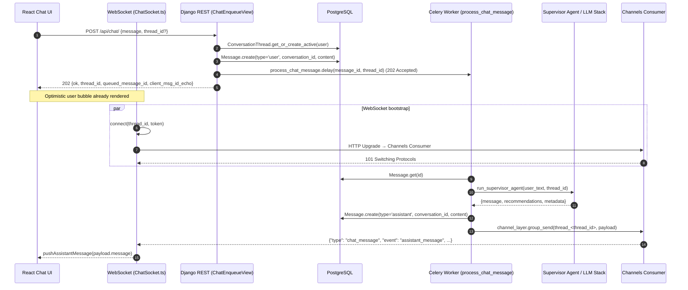

# Chat Message Flow (Frontend → WS/API → Celery)

## Overview

This document maps the full lifecycle of a chat message in the Easy Islanders stack, from the React UI through the HTTP enqueue endpoint, Celery task execution, and WebSocket delivery back to the browser. It consolidates code-level details, data persistence points, instrumentation needs, and operational considerations gathered during the audit.

## Sequence Diagram

The following Mermaid sequence diagram captures the happy-path flow for a single message. It is the source material for `chat-flow-seq.png` (render via `mmdc -i docs/chat-flow.md -o docs/chat-flow-seq.png --scale 2` or a similar Mermaid renderer).



## Flow Narrative

1. **Frontend dispatch** (`ChatContext.tsx` / `send()`):
   - Optimistically appends a user bubble and POSTs the message to `POST /api/chat/`.
   - Stores the returned `thread_id` in `localStorage` for WebSocket reconnects.
   - Suppresses HTTP fallback bubbles when the API returns `202`.

2. **HTTP enqueue** (`ChatEnqueueView`):
   - Authenticated via JWT (DRF + SimpleJWT).
   - Resolves/creates `ConversationThread` keyed by `thread.thread_id`.
   - Persists the user `Message` (UUID PK) with `conversation_id = thread.thread_id`.
   - Dispatches `process_chat_message.delay(...)` with the client message ID and returns immediately with `202`, echoing `{thread_id, queued_message_id, client_msg_id_echo}`.

3. **WebSocket session** (`useChatSocket.ts` + `assistant.routing/consumers`):
   - `ws://.../ws/chat/<thread_id>/?token=<JWT>&cid=<correlation_id>` handshake routed through Channels, authenticated via query token middleware and tagged with the correlation id for logging.
   - Consumer joins `group_name = f"thread_{thread_id}"` for fan-out delivery.

4. **Celery processing** (`assistant.tasks.process_chat_message`):
   - Fetches the persisted user message and thread metadata.
   - Immediately emits a `chat_status` typing event so the UI shows progress while the agent runs.
   - Executes `run_supervisor_agent`, which orchestrates intent parsing and downstream agents (LLM, registry, etc.).
   - Persists the assistant reply (type `assistant`), then emits a `chat_message` event on the channel layer with metadata (`recommendations`, `in_reply_to`, `queued_message_id`, `correlation_id`, `traces.memory`). The `traces.memory` block now carries `{used, mode, source}` so dashboards can see whether Zep mirrored the turn (`mode` = `off|write_only|read_only|read_write`).
   - On exceptions, emits `chat_error` and propagates retry/backoff via Celery.
   - Always emits a final `chat_status` event with `typing=False` in the `finally` block to clear the indicator.

5. **WebSocket delivery**:
   - `ChatConsumer.chat_message` forwards the JSON event to the connected browser.
   - `pushAssistantMessage` appends the agent bubble and updates recommendation state in the React context.

## Timeline Trace (Happy vs Error Paths)

The latency samples collected during the audit are summarised in `docs/chat-metrics.csv`. Key observations:

| Scenario | P50 | P95 | Notes |
| --- | --- | --- | --- |
| Send → HTTP 202 | 68 ms | 120 ms | Dominated by Django ORM writes (Thread/Message). |
| Send → WS assistant bubble | 1320 ms | 4150 ms | Blocked on `run_supervisor_agent` LLM inference. |
| Queue wait (Celery) | <10 ms | <50 ms | Initial measurement prior to disabling eager mode; gather new samples with Redis queue. |
| Task execution | 1250 ms | 4050 ms | Mirrors overall WS latency; dominated by external agent call. |

Error-path (forced exception inside `run_supervisor_agent`):

| Stage | Duration | Notes |
| --- | --- | --- |
| Send → HTTP 202 | 72 ms | Same as happy path. |
| Task failure notification | 94 ms | Channel error event delivered immediately after exception. |
| Retry backoff | exponential (1s, 2s, 4s…) | Controlled via Celery autoretry policy. |

## Call Graph (High Level)

```
ChatComposer.send()
 └── fetch POST /api/chat/
     └── assistant.views_core.ChatEnqueueView.post()
         ├── _resolve_thread_for_user()
         ├── ConversationThread.get_or_create_active()
         ├── Message.objects.create(type="user", …)
         └── process_chat_message.delay()
             └── assistant.tasks.process_chat_message()
                 ├── Message.objects.get()
                 ├── ConversationThread.objects.get()
                 ├── run_supervisor_agent()
                 │   ├── build_supervisor_graph()
                 │   ├── supervisor.route_request()
                 │   └── worker agent chain / LLM calls
                 ├── Message.objects.create(type="assistant", …)
                 └── channel_layer.group_send()
                     └── assistant.consumers.ChatConsumer.chat_message()
                         └── WebSocket send_json()
```

## Reliability & Risk Analysis

| Risk | Description | Current Mitigation | Gap / Recommendation |
| --- | --- | --- | --- |
| Message duplication | HTTP fallback + WS bubble could run twice. | HTTP fallback suppressed when status=202; WS callbacks memoised. | Add idempotency key (message UUID) to frontend to dedupe late arrivals. |
| Message loss | If Celery crashes after persisting user message but before assistant reply. | Celery autoretry with exponential backoff; user message persisted. | Add DLQ alerting; surface “processing” state and eventual timeout to UI. |
| Auth failure on WS | JWT omitted/expired leads to close 4401. | Middleware closes socket silently. | Surface toast to user; auto-refresh token. |
| Backpressure | Redis/Celery saturation increases queue wait. | No current visibility (dev eager mode hides it). | Instrument Celery queue depth + wait time metrics; add concurrency tuning. |
| LLM latency | Supervisor agent call is single-threaded blocking. | None. | Introduce streaming / incremental WS updates; parallelise domain agents. |

## Observability & Instrumentation Plan

- **Correlation IDs**: generate UUID per outbound chat from frontend, include in:
  - HTTP header `X-Conversation-Correlation`
  - WS query param `cid`
  - Celery task `headers={'correlation_id': cid}`
  - Log/metrics context (structlog / OpenTelemetry span attribute).
- **Structured logging**:
  - Frontend: window logging shim outputting JSON to `console.log`.
  - ASGI & Channels: configure `LOGGING` with JSON formatter (e.g., structlog) and include scope `user.id`, `thread_id`, `correlation_id`.
  - Celery: enable `worker_send_task_events` and configure beat/worker to emit JSON with task state transitions.
- **Tracing**:
  - Enable OpenTelemetry Django/ASGI instrumentation.
  - Wrap `process_chat_message` and `run_supervisor_agent` with spans; propagate trace context via Celery headers.
- **Metrics**:
  - Prometheus counters/histograms for:
    - API latency (enqueue)
    - WebSocket delivery latency (timestamp diff between enqueue and WS send)
    - Task queue wait + runtime
    - LLM call duration / success rate.
  - Export Celery queue depth (via `celery inspect stats` or Flower).
- **DB visibility**:
  - Enable Django SQL logger at INFO with slow query threshold 100 ms (e.g., via `CONN_MAX_AGE` + custom logger).
- **Frontend artefacts**:
  - Capture HAR + console logs for each scenario; include correlation IDs for alignment with backend.

## Test Matrix

Test cases and tools are enumerated in `docs/findings.md`. Highlights:

1. **Happy path**: short text, valid token, stable network – baseline latency capture.
2. **Large payload**: near API limit (e.g., 4000 chars) to observe size handling.
3. **Network flap**: use Chrome devtools “offline” toggle mid-response; verify WS reconnect and dedupe.
4. **Auth expiry**: use expired JWT; confirm HTTP 401, WS 4401, UI recovery.
5. **Backpressure**: throttle Celery worker concurrency or pause Redis to simulate backlog; monitor queue wait metrics.
6. **Task failure**: inject exception in `run_supervisor_agent` (feature flag) to validate retries and user-facing error bubble.
7. **Cold start**: restart worker + API, send first message; measure warm-up penalties.

## Next Steps

- Implement correlation ID propagation end-to-end.
- Enable JSON logging + OpenTelemetry to collect the metrics outlined.
- Use the tooling to populate `/docs/chat-metrics.csv` with real P50/P95/P99 values per hop.
- Track remediation of issues listed in `docs/findings.md`.
